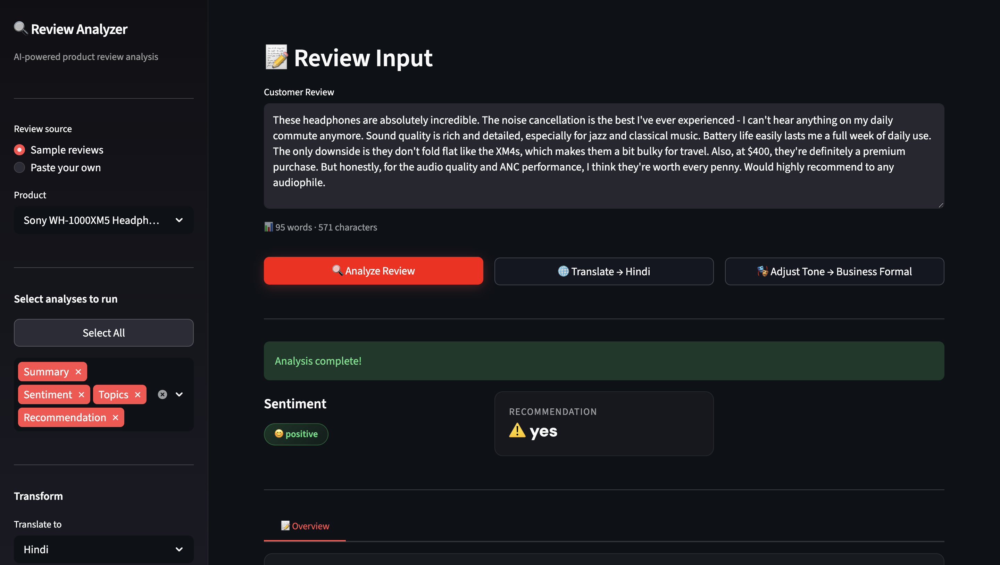
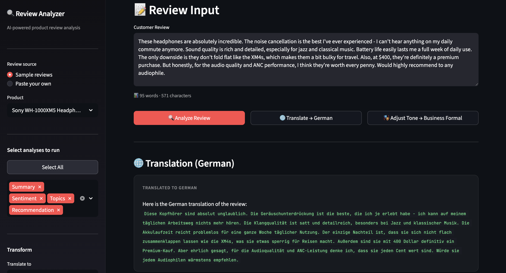
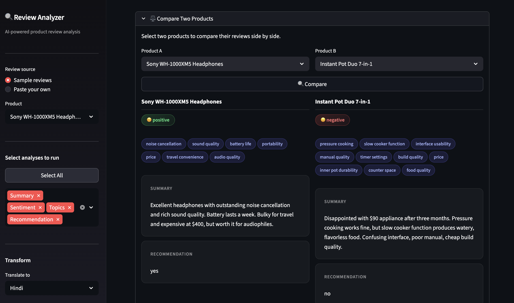

# Product Review Analyzer
AI-powered product review analysis using prompt engineering techniques learned from DeepLearning.AI's **ChatGPT Prompt Engineering for Developers** course.







## About

This project applies prompt engineering concepts:
- summarizing, 
- inferring, 
- transforming, 
- and expanding 

to analyze product reviews and extract meaningful insights. 
Every feature maps directly to a module from the course, demonstrating practical prompt engineering without any fine-tuning or custom ML models.


## Features

- **Summarize**: Concise review summaries with focused views for shipping and value
- **Infer**: Sentiment detection, emotion analysis, topic extraction, and purchase recommendation
- **Transform**: Translate reviews to multiple languages, adjust tone, and fix grammar
- **Expand**: Auto-generate customer service replies tailored to review sentiment
- **Compare**: Side-by-side analysis of two product reviews
- **Download Report**: Export analysis results as a markdown file
- **Interactive UI**: Streamlit app with sidebar controls, feature toggles, progress tracking, and support for both sample and custom reviews


## Tech Stack

>Python 3.12
>
>Anthropic Claude API
>
>Streamlit
>
>python-dotenv


## Setup

Clone the repo

```bash
    git clone https://github.com/AnushreeAnkola/Product-Review-Analyzer.git
```

```bash
    cd Product-Review-Analyzer
```

Create and activate a virtual environment

```bash
    python3.12 -m venv venv
```
```bash
   source venv/bin/activate
```

Install dependencies

```bash
    pip install -r requirements.txt
```

Add your Anthropic API key

```bash
    cp .env.example .env
   # Edit .env and add your key
```

Run the app

```bash
    streamlit run app.py
```

## Live Demo

[Try the app here](https://a-review-analyzer.streamlit.app/)